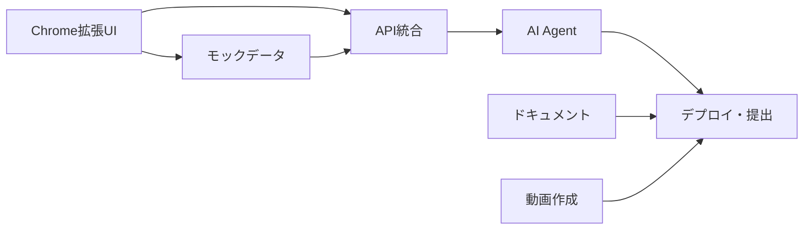

# HP Planner 段階的フォールバック戦略

## 基本方針：確実に動くものを段階的に構築

**「完璧を目指すより、動くものを確実に」**

1ヶ月という制約下では、技術リスクや実装の複雑さに対して柔軟な対応が必要。  
各週ごとに**最低限達成すべきライン**と**理想的なゴール**を設定し、状況に応じて調整する。

---

## Week別フォールバック戦略

### Week 1: Chrome拡張UI基盤 (8/27-9/3)

#### 💚 Level 1: 最低限MVP (絶対達成)
- **SVGリング HP表示**: 固定値75%でも表示される
- **基本レイアウト**: popup.html が開く・見た目が整っている
- **Options画面**: 基本設定画面が開く（機能しなくてもOK）

#### 💛 Level 2: 標準版 (目標達成)
- **動的HP更新**: JavaScriptでHP値変更・表示更新
- **モックデータ**: 天気・会議データで計算実行
- **60秒ポーリング**: 自動更新・Service Worker動作

#### 💙 Level 3: 理想版 (余裕があれば)
- **トースト通知**: 閾値到達時のポップアップ
- **設定保存**: Chrome Storage API で永続化
- **.ics生成**: 休憩予定ダウンロード機能

#### ⚠️ Week 1 フォールバック判定
**9/1時点で Level 2 未達成の場合**:
- Week 2の実API統合を延期
- Week 1を2-3日延長してUI完成を優先
- 全体スケジュールをズラし、AI Agent機能を簡略化

---

### Week 2: 実API統合・GCP基盤 (9/4-9/10)

#### 💚 Level 1: 最低限MVP
- **Firebase プロジェクト**: 作成・基本設定完了
- **Open-Meteo API**: 天気取得成功・1回でもHP計算実行
- **Chrome ↔ Functions**: Hello World レベルの通信確立

#### 💛 Level 2: 標準版  
- **Cloud Functions**: HP計算・天気取得が安定動作
- **Firestore**: データ保存・読み出し成功
- **E2E実データフロー**: 天気→HP算出→拡張表示

#### 💙 Level 3: 理想版
- **Cloud Scheduler**: 毎日06:00自動天気取得
- **エラーハンドリング**: API障害時のフォールバック
- **パフォーマンス**: レスポンス時間1秒以内

#### ⚠️ Week 2 フォールバック戦略

**Vertex AI認証で躓いた場合**:
```javascript
// OpenAI API に即座に切り替え
const OPENAI_API_ENDPOINT = 'https://api.openai.com/v1/chat/completions';

async function generateHPReason(weather) {
  const response = await fetch(OPENAI_API_ENDPOINT, {
    method: 'POST',
    headers: {
      'Authorization': `Bearer ${OPENAI_API_KEY}`,
      'Content-Type': 'application/json'
    },
    body: JSON.stringify({
      model: 'gpt-3.5-turbo',
      messages: [{
        role: 'user',
        content: `天気: 最高${weather.tmax}℃, 最低${weather.tmin}℃, 降水確率${weather.rain}%の日のHP初期値理由を1文で`
      }],
      max_tokens: 100
    })
  });
  return response.json();
}
```

**Cloud Functions デプロイ失敗の場合**:
- Vercel/Netlify Functions に移行
- もしくは Chrome拡張内でAPI呼び出し（CORS制約あり）

**Firestore コスト過大の場合**:
- Chrome Storage API のみで運用
- JSON ファイル出力でデータ管理

---

### Week 3: AI Agent統合 (9/11-9/17)

#### 💚 Level 1: 最低限MVP
- **1つのAI Agent**: HPプランナー（天気→理由文生成）のみ
- **Vertex AI接続**: 1回でも正常にレスポンス取得
- **基本プロンプト**: 固定テンプレートで動作

#### 💛 Level 2: 標準版
- **2-3つのAI Agent**: HPプランナー + 会議メタ推定 + ブレイク提案
- **JSON出力**: 構造化された結果取得・パース成功
- **Chrome拡張統合**: AI提案をトースト表示

#### 💙 Level 3: 理想版  
- **4つのAI Agent完全版**: 全Agent + 高精度プロンプト
- **会議ナビゲータ**: 短縮/非同期化提案・文面生成
- **プロンプトエンジニアリング**: 出力精度向上・エラー率低下

#### ⚠️ Week 3 フォールバック戦略

**Vertex AI制限・高コストの場合**:
```javascript
// ルールベースAIに切り替え
class RuleBasedAgent {
  generateHPReason(weather) {
    if (weather.tmax > 30) return "高温のため疲労しやすい1日です";
    if (weather.rain > 50) return "雨で気分が重くなりがちです";
    return "良好な天気で活動しやすい1日です";
  }
  
  estimateMeetingType(title) {
    if (title.includes("決定") || title.includes("承認")) return "決定";
    if (title.includes("ブレスト") || title.includes("アイデア")) return "ブレスト";
    if (title.includes("報告") || title.includes("共有")) return "報告";
    return "企画"; // デフォルト
  }
  
  suggestBreak(hp) {
    if (hp <= 10) return "10分休憩を強く推奨します";
    if (hp <= 25) return "5分休憩をお勧めします"; 
    if (hp <= 40) return "疲労が見えます。小休憩はいかがですか？";
    return null;
  }
}
```

**API レスポンス時間過大の場合**:
- キャッシュ機能強化（同じ天気・会議は再利用）
- プリコンピュート（事前に典型パターン計算）
- タイムアウト設定（3秒以内or固定メッセージ）

---

### Week 4: 統合・デプロイ・提出 (9/18-9/24)

#### 💚 Level 1: 最低限MVP
- **本番デプロイ**: 何らかの形でWeb上で動作確認可能
- **GitHub リポジトリ**: コード公開・基本README
- **Zenn記事**: 1000文字以上・デモ動画埋め込み

#### 💛 Level 2: 標準版
- **安定動作**: 24時間エラーなしで稼働
- **完全ドキュメント**: セットアップ手順・API仕様
- **3分デモ動画**: 全機能紹介・効果説明

#### 💙 Level 3: 理想版
- **パフォーマンス最適化**: レスポンス1秒以内
- **豊富な検証データ**: 効果測定・ユーザーテスト
- **受賞レベル品質**: コード・設計・ドキュメント完璧

#### ⚠️ Week 4 緊急時フォールバック

**本番デプロイ失敗の場合**:
1. **GitHub Pages**: 静的サイトとしてデプロイ
2. **Vercel**: Next.js化して即座にデプロイ  
3. **ローカルデモ**: 録画で全機能を紹介

**動画作成時間不足の場合**:
```markdown
# 最小限デモ動画構成（90秒版）
1. 課題説明 (20秒)
2. HP表示・計算デモ (40秒) 
3. AI Agent 1つだけ紹介 (20秒)
4. まとめ・今後 (10秒)
```

**Zenn記事執筆遅延の場合**:
```markdown
# 簡略版記事構成（1500文字）
## 課題 (300文字)
## 解決策 (400文字)  
## 技術構成 (400文字)
## 効果・今後 (200文字)
## デモ動画 (埋め込み)
## GitHub (リンク)
```

---

## 技術リスク別フォールバック

### 1. Vertex AI関連リスク

**リスク**: 認証失敗・制限・高コスト・レスポンス遅延

**対策レベル**:
1. **OpenAI API**: GPT-3.5-turbo で代替（$20以内）
2. **ルールベース**: if-else ロジックで簡易AI
3. **固定メッセージ**: 事前定義されたテンプレート

**実装例**:
```javascript
class FallbackAI {
  async generateText(prompt, fallbackLevel = 1) {
    try {
      return await this.vertexAI(prompt);
    } catch (error) {
      console.warn('Vertex AI failed, fallback level:', fallbackLevel);
      
      switch(fallbackLevel) {
        case 1: return await this.openAI(prompt);
        case 2: return this.ruleBasedResponse(prompt);
        case 3: return this.staticResponse(prompt);
        default: return "システム準備中です";
      }
    }
  }
}
```

### 2. Chrome拡張MV3制約

**リスク**: Service Worker制限・Permission不足・API制約

**対策レベル**:
1. **Popup中心設計**: Background処理を最小化
2. **Content Script**: ページ内でのHP表示
3. **Web App**: 通常のWebアプリケーションに変更

### 3. Cloud Functions制約

**リスク**: コールドスタート・デプロイ失敗・制限

**対策レベル**:
1. **Vercel Functions**: サーバーレス代替
2. **クライアントサイド**: 全処理をブラウザ内実行
3. **静的API**: JSON ファイルでのモックAPI

### 4. 時間制約・実装遅延

**週次判定基準**:
```javascript
const WEEK_SUCCESS_CRITERIA = {
  week1: {
    minimum: ["UI表示", "基本レイアウト"],
    target: ["HP計算", "設定画面"],
    ideal: ["通知", "データ永続化"]
  },
  week2: {
    minimum: ["Firebase接続", "天気API"],
    target: ["Cloud Functions", "E2Eフロー"], 
    ideal: ["エラーハンドリング", "最適化"]
  },
  week3: {
    minimum: ["1つのAI Agent"],
    target: ["3つのAI Agent"],
    ideal: ["4つのAI Agent", "高精度化"]
  },
  week4: {
    minimum: ["デプロイ", "基本ドキュメント"],
    target: ["安定動作", "完全ドキュメント"],
    ideal: ["最適化", "受賞品質"]
  }
};

// 毎週金曜日に判定・翌週計画調整
function assessWeekProgress(week, completedItems) {
  const criteria = WEEK_SUCCESS_CRITERIA[week];
  const minimumMet = criteria.minimum.every(item => 
    completedItems.includes(item));
  const targetMet = criteria.target.every(item => 
    completedItems.includes(item));
    
  if (!minimumMet) {
    return "CRITICAL"; // スケジュール大幅変更必要
  } else if (!targetMet) {
    return "WARNING";  // 一部機能削減検討
  } else {
    return "ON_TRACK"; // 予定通り進行
  }
}
```

---

## 緊急時エスカレーション・意思決定

### Critical Path Analysis


**最重要パス**: A → B → C → D  
**並行作業可能**: F, G は Week 3 から開始可能

### 意思決定フレームワーク
1. **機能削減判断**: ユーザー価値・技術難易度・時間コストで評価
2. **技術変更判断**: 学習コスト・実装リスク・制約回避で評価  
3. **スケジュール調整**: クリティカルパス・バッファ時間・提出要件で評価

---

この**段階的フォールバック戦略**により、どのような技術的困難や時間制約に直面しても、**必ず動くプロダクトを提出**できます！